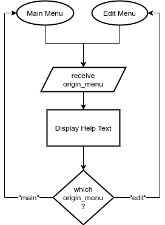

# Listr

***Listr is an assignment written for Coder Academy. It's a little buggy in linemode. I plan to convert it to MVC design patterns, and significantly refactor it's state management, now that I know better.
The following README.md was written for the assignment submission. It will eventually be replaced when I feel ready to release Listr to the world properly.***

## QUICK START

### To run the script:

1. Open Terminal
2. `cd` to Listr's Directory
3. Type `./lister.sh`

### To install Listr

**Linemode is only available from any directory after install script is run.**

*** INSTALL AT YOUR OWN DISCRETION. THIS WILL CREATE A COPY OF LISTER IN YOUR `~` DIRECTORY, AND A SYMBOLIC LINK IN usr/local/bin***

**To use linemode without running install script, add an alias to your .bashrc file (This is a different process on each system).**

1. Open Terminal
2. `cd` to Listr's Directory
3. Type `sudo ./install-lister.sh`
4. Enter Password
5. Run `lister` from commandline

## R4 Link to Source Control

<https://github.com/Yearnsmith/DerickYearnsmith_t1a3>

## R5 Software Development Plan

### Purpose and Scope

The purpose of lister is easy management of simple, unordered lists.

The scope has been to create a terminal app that can be operated in an interative manner, and directly from the command-line once installed.

#### Describe at a high level what app will do

Listr is a list manager. It allows users to create, edit, and save lists.

#### identify the problem it will solve and explain why you are developing it

##### Maintaining Lists

Makers and Creators use many kinds of lists:

- Kanban Planning
- Dependencies
- issues
- future projects
- new features
- lists of important lists!

Often ideas coem to us in the middle of an unrelated task. We have a choice to either let the idea go free or break our flow, load up a .txt, .doc, or pull out an old fashioned notepad and pen to write them down. For the creative type who uses a CLI, Listr enables them to quickly add to, remove from, or export a list from their CLI without changing directory, or opening a new terminal.

Listr also allows users to interact with lists in an interactive, distraction-free environment, with options to edit list items, and re-order them.

I am developing this app to help people like myself keep on task and not be distracted by new, exciting thoughts as they arise. It also will allow me to:

1. Work with file I/O
2. Feed inputs from the command line into the list
3. Perform interesting tasks with arrays, hashes, and other data-types
4. I can eventually port it to a Rails app, or other GUI interface for the Interactive Mode

#### identify the target audience

Listr's target audience is creators who work in a CLI, and don't enjoy being distracted or discarding cool ideas.

It's also aimed at people who like making lists.

#### explain how a member of the target audience will use it

There are two ways to use Listr: *Interactive mode* and *Linemode*. Listr automatically detects which mode is being used.

##### Interactive Mode

`./lister.sh [list-title] [list-item]`

**Interactive mode** clears the screen, and allows the user to edit a list by following prompts.

`./lister.sh list-title`

will load lister in Interactive mode, along with a file with a name that matches `list-title`.

If a matching file name doesn't exit, Listr will create the file, and interact with it.

`./lister.sh list-title list-item`

Will behave the same as above, and also append `list-item` to the list.

`./lister.sh`

Running `./lister.sh` without arguments will load lister into a cleared screen and the user will be prompted to create or load a new list.

#### Operating within Interactive mode

Using Interactive Mode, Listr makes use of TTY-Prompt to give user an interactive list of options to choose between.

There is a new screen each time the user selects an option.

#### Linemode

**Linemode is only available from any directory after install script is run.**

**To use linemode without running install script, add an alias to your .bashrc file (Or equivalent). You should run the lister.sh file at least once, to install dependencies.**

1. Run `lister.sh` file once
2. add `alias lister='PATH_TO_YOUR_LISTER_DIRECTORY/app-files/lister.rb` to your .bashrc (or equivalent).
3. change PATH_TO_YOUR_LISTER_DIRECTORY to wherever you have the folder containing Listr.

`lister [option] [list-title] [list-item]`

`lister [ -a | -r list-title list-item ]`

`lister -c list-title [list-option]`

`lister -e list-title`

**Express** mode runs a specific feature of Listr, based on the options given.

##### Options

- -a, --**a**dd

Append an item to a list. Requires user to give list-title and list-option. If list-title doesn't exist, a new list will be created.

- -e, --**e**cho

print a list to command line. Requires user to give list-title

- -r, --**r**emove

remove an item from a list. Requires user to give list-title and list-option.

##### `list-title`

`list-title` may be entered two ways:

1. Single words for titles with 1 word *e.g.* `Ideas`
2. Strings surrounded by quotes for `list-title`s comprising multiple words\
*e.g.* `"Killer Novel Ideas"`

##### `list-item`

The item to be added or removed. It may also be a single word, or a string surrounded by quotes.

## R6 Develop a list of features that will be included in the application.

### Automatic mode detection

The first thing Listr does on opening is read the syntax of ARGV, and direct the program to the appropriate `control flow`.

### Interactive Mode

Interactive Mode is just that: the terminal will be cleared, and users will be presented with a menu for interacting with Listr. This feature will make heavy use of the `TTY-Prompt` and `colorize` gems. It utilises a `case when` statement to map the users' selection to methods contained in `List` class.

The user will first be presented with a menu informing of the following options:

- Create List
- Edit List
- Help
- Exit

#### Create List

This is the main feature of Listr. The app will prompt the user for a title and first item. Listr will then construct a hash out of the answers, feeding them to a new `List` object.
The hash will be in the following format to enable it to eventually be stored as a YAML file: `{ "list_title" => [list_items] }`

List objects have the following instance variables:

- `@list_title`: A string containing the title of the list
- `@list_contents`: An array with each list-item.
- `@list_hash`: A hash in the format - 
- key: `@list_title`
- value: `@list_contents`

Once the list has been created, Listr will invoke the `list_edit_menu` `TTY::Prompt` object, prompting the user to continue modifying the list.

#### Edit List

Users of Listr are able to edit lists they have saved to file.

Users will select "Edit List" from the Interactive Mode menu and Listr invokes the `.edit_list` within Listr's `State` class.

`.edit_list` prompts the user to select from an array of list titles passed from `State` class' `@curent_state` hash. This is an array containing strings that map to every .yml file in Listr's `/lists` directory (`../src/lists/`)

Once a user selects a list to edit, the YAML file is passed as a hash into the `list` object, invoking the `list_edit_menu` `TTY::Prompt` object.

This object consists of the following options:

- Add item
- Remove item
- Change list title
- Save list
- Help
- Return to main menu

#### Add Item

Listr users may add items to their list one at a time.

Listr will utilise the `.add_item` method in the `List` class. This behaves in the following way:

`.add_item` will prompt the user for the item they wish to add, store this local variable `item_to_add`, then append the item to the `@list_items` array. `item_to_add` will future-proof the app for a possible `.undo` method.

#### Remove Item

Listr users may remove items to their list one at a time.

Listr will utilise the `.remove_item` method in the `List` class. This behaves in the following way:

`.remove_item` prints the current iteration of the list for the user's convenience. It then prompts the user for the item they wish to add, stores this to local variable `item_to_remove`, matches `item_to_remove` to a value in the `@list_items` array, and performs `.remove` on the matched item. `item_to_remove` will also future-proof the app for a possible `.undo` method.

#### Change List Title

It may occur that when a user is part-way through, or finished populating their list, they wish to chnage it's name. Upon selecting "Change List Title", Listr will utilise the `.update_title` method in the `List` class.

`.update_title` will prompt the user for a new title, and store it to local variable `new_list_title`. The current `List` object's `@list_title` will then be updated with `new_list_title`'s value. This local variable will also prepare for a possible `.undo` method.

#### Save List

Some lists are never completed — but users can't live their entire lives sitting in front of Listr! Not consecutively. `.save_list` allows users to save their lists to work on at a later time. Lists are saved to `~/Documents/lister`.

`.save_list` is a method within `List` class. `.save_list` converts the `@list_hash` to YAML formatting utilising *Psych's* `Psych.dump()`. Then writes the returned string to a YAML file using `IO.write` (From Ruby's `IO` class). This handy method opens, writes to, and closes a file, before returning the number of bytes written.

Once the file has been saved, Listr returns the user to the edit menu.

### Linemode

In *Linemode*, the user will instruct Listr without an interface appearing. *This is only available on a full installation of Listr*.

`lister <option> <list-title> [list-item]`

One of the first things Listr does on opening is read the syntax of ARGV, and direct the program to the appropriate `control flow`. If the user has input any of the Linemode options (`-a`, `-r`, `-e`) Listr will invoke a `.find_list` method in the `State` class. This matches `list-title` to a file with the same name and creates a new `List` object.

Listr will read the other items in ARGV, and feed these to the appropriate method.

Listr will automatically save the list, and provide confirmation that an item has been added or removed.

If Listr encounters any errors (missing arguments, non-existent list or items for -r), Listr will explain the error and close, to keep with expected behaviours of line-mode applications.

`lister -a <list-title> <list-item>`
Listr invokes [`.add-item`](#add-item) method in the `List` class.
If `list-title` doesn't exist Listr will invoke `.create_list` from `List` and pass in the shell variables.

`lister -r <list-name> <list-item>`
Will do the same, except it will `pop` `$3` from `$2` by invoking `.remove_item` from `List`. If `list-item` doesn't exist, Listr will inform the user and close.

`lister -e <list-name>`
Listr will `puts` the list into the terminal, by overiding the `.to_s` method in `List`.

## R7 Develop an outline of the user interaction and experience for the application.

### How the user will find out how to interact with / use each feature

- The whole process is guided by a series of prompts.
  - Prompts have help text to accompany them
- There is a help option in both main control flow and editing control flow

### How the user will interact with / use each feature*

- New List
  - User selects "New List" in Main menu
  - User is prompted to type list title they wish to add
    - Listr won't accept a blank list (TTY-Prompt configuration)
    - Listr checks if a list with that title already exists
      - prompts for a new title if check returns true
    - Listr checks if the title contains invalid characters
      - prompts for a new title if check returns true
  - User is taken to Editing menu

- Add Item:
  - An item may be added by selecting add item in an Editing menu.
  - The user is prompted to type the item they wish to add
  - The user presses `Enter` key
  - User is provided a confirmation the item was added
  - User is returned to Editing menu.

- Remove Item:
  - Item may be removed item may be added by selecting add item in an Editing menu.
  - The user is to select item from a list
  - The user hovers over list item to remove
  - The user presses `Enter` key to remove their selection
  - User is prompted to confirm deletion
  - User is provided a confirmation the item was removed
  - User is returned to Editing menu.

- Change List Title
  - User selects "Change Title" in Editing menu
  - User is prompted to type new title
    - Listr won't accept a blank list (TTY-Prompt configuration)
    - Listr checks if a list with that title already exists
      - prompts for a new title if check returns true
    - Listr checks if the title contains invalid characters
      - prompts for a new title if check returns true
    - User recieves confirmation
  - User is taken to Editing menu

- View List:
  - User selects "View List" in Editing menu
  - The list is displayed in system pager (i.e. less, more, TTY-Pager)
  - User is taken to Editing Menu
  
- Save List:
  - User selects "Save List" in Editing menu
  - The list is displayed in system pager (i.e. less, more, TTY-Pager)
  - User is taken to Editing Menu

### How errors will be handled by the application and displayed to the user

Most errors are avoided through conditional control loops, or libraries that prevent invalid input.

Users never directly control I/O. Listr will scan folders and populate yaml files into an array of files to load. Listr repopulates this list every time a file is saved and a list is created. This list is aslo populated as lister first starts — so titles added, but not saved, will not be available after app closes (which is desirable).

Errors concerning missing files or directories are handled by conditional control flows — if titles are not in list, they probably aren't in the directory.

Errors such as handling missing list items will try to reload a yaml file, and if that is not successful returns user to main menu with a message that their list file has an issue,
or has been modified externally.

For Linemode options, Listr will exit immediately with a message providing context. For usablility, I have not let users see a thrown error.

## R8 Develop a diagram which describes the control flow of your application.

### App Flow

### Create List Diagram

### Edit List Diagram

### Add Item Diagram

### Remove Item Diagram

### Change Title Diagram

### Save List Diagram

### Load File Diagram

### Help Diagram

## R9 Develop an implementation plan

[See Trello Board](https://trello.com/b/NpMwgFQA)

## R10 Design help documentation which includes a set of instructions which accurately describe how to use and install the application.

## Listr

Thank you for using Listr. Listr makes it easy to manage lists via a command-line interface.

### Getting Started

#### Installing Listr

Installing Listr is as simple as running the script...

**To run the script:**

1. Open Terminal
2. `cd` to Listr's Directory
3. Type `./run-lister.sh`

**To "install" Listr**

Add an alias in your .bashrc pointing to Listr's file. This is different in each system.

***OR**

**NOTE: The following method creates files in your home directory, and /usr/local/bin.**

1. Open Terminal
2. `cd` to Listr's Directory
3. Type `sudo ./install-lister.sh`

**Listr requires the following dependencies:**

- A Terminal *(Bash, GNOME Terminal, WSL, etc.)*
- Ruby
- Ruby Gems

**Listr will install the following dependencies:**

- Psych
- tty-prompt
- tty-pager
- pastel
- Bundler
- Rspec

#### Creating Your First List

Simply Type: `./lister.sh "Your Title" "Your First Item"`

or `./lister.sh -a "Your Title" "Your First Item"` if you wish to stay in the command prompt.

### Using Listr

There are two ways to use Listr: Interactve mode and Linemode. Listr automatically detects which mode is being used.

#### Operating in Interactive Mode

Interactive mode is the default way to use Listr. It allows you to edit a list by following prompts.

When Interactive Mode loads, the Main Menu will appear. Press the up and down keys on your keyboard to move between options. Press select to select it.

This same functionality is present throughout most of Listr's menus.

##### Creating A New List

Beginning a new list in Interacive Mode is as simple as selecting*New List" from the Main Menu, and entering a title when prompted.

***Important: Each note must have a unique title, and titles are\ncase-sensitive.***

##### Edit An Existing List

To edit an existing list, select *Edit List* from the Main Menu. Listr will show a new menu containing all of your lists. Select from these as you have other menus.

##### Add an Item

To add an item, select Add Item from the menu, and type the item when the prompt appears. The item will be appended, or, added to the end of the list.

##### Remove an Item

To remove an item, select *Remove Item* from the menu, and select the item from the interactive list. If the item is not on the screen, continue scrolling down, or use the `←` and `→` keys to page through.

Pressing `Enter` while the item is highlighted will be remove the item.

##### Change A List's Title

To change the title of a list, select *Change title*. Listr will prompt you for a new title.

##### View Your List

To view the list select *View List*. The current list will be printed to the screen.

##### Save Your List

To save a list select *Save List*. Listr will automatically name the save-file with the name of your list.
Lists are saved to `~/Documents/lister`. They are in YAML format, and easy to read outside of lister. However, modificaion outside of lister may cause them to become unreadable to Listr!

##### Get Help

Selecting  *Help* on either the Main or Edit menus displays this help text.

##### Return To Main Menu

To return to the main menu, select *Return To Main Menu*.

***Important: Listr does not auto-save. Any unsaved changes will be lost!***

##### Exit Listr

When you are finished editing your list select *Exit* from the Main Menu.

#### Utilising Linemode

**Linemode is only available from any directory after install script is run.**

*** INSTALL AT YOUR OWN DISCRETION. THIS WILL CREATE A COPY OF LISTER IN YOUR `~` DIRECTORY, AND A SYMBOLIC LINK IN usr/local/bin***

**To use linemode without running install script, add an alias to your .bashrc file (This is a different process on each system).**

Using Listr direcly from the command-line is as simple as typing:

`lister [option] [list-title] [list-item]`

`[list-title]` may be entered with or without surrounding quotes. *i.e. "title"*

List titles that contain spaces (i.e. are more than one word) must be surrounded by quotes. *i.e. "title with spaces"*

##### Options

**`-a`** or **`--add`**

Add `[list-item]` to the end of `[list-title]`.

If `[list-title]` doesn't exist, Listr will create a new list named `[list-title]` that title, and append `[list-item]` to the list.

**`-r`** or **`--remove`**

Removes the last occurance of `[list-item]` from `[list-title]`

**Some linemode options only take 1 argument:**

`lister [option] [list-title]`

**`-e`** or **`--echo`**

Prints your list to the screen. It is possible to combine this with your pager (i.e. less):

`lister -e [list-title] | less`

Or pass it to a new file:

`lister --echo [list-title] >> [filename]`

**`-a`** or **`--add`**

`lister -a [list-title]`

Will create a new list named `[list-title]` if `[list-title]`
doesn't exist.

#### Jumping into Interactive Mode:

It's possible to jump straight to a function in Interactive Mode from the command line:

`./lister.sh [list-title]`

Will load lister in Interactive mode, along with a file with the name `[list-title]`, and display the *Edit Menu*.

If `[list-title]` doesn't exist a matching file name doesn't exist, Listr will create a new list.

`./lister.sh [list-title] [list-item]`

Will behave the same as above, and also append `[list-item]` to the list before opening Edit menu.
